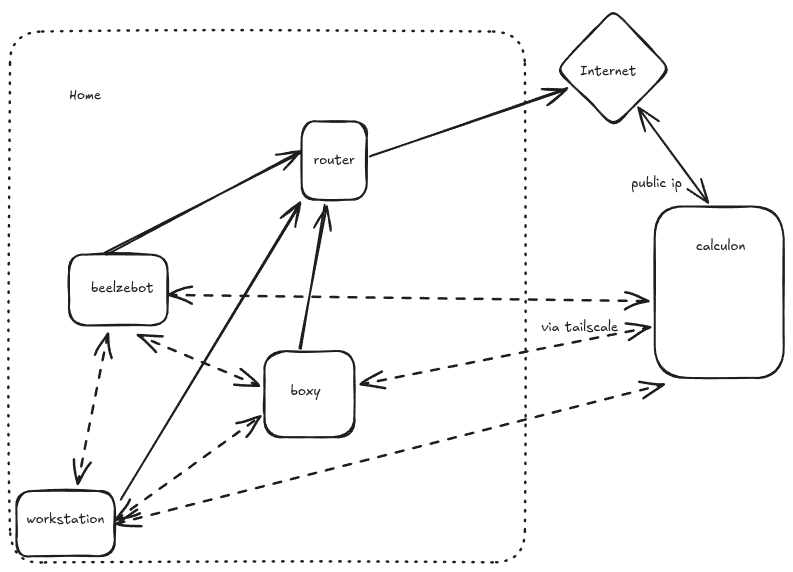
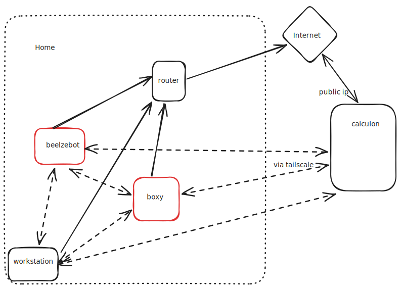
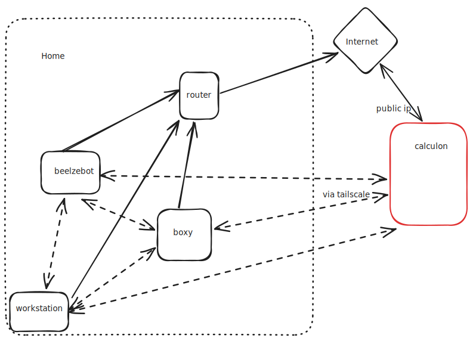

% Self Hosting in 2025: A practical approach
% giacomo
% @@DATE@@

# Ma soprattuto, perché?

> * Non è una questione di soldi 💸, ne di privacy 🥸
> * Sostanzialmente una questione di controllo

::: notes
un po' anche un hobby
ognuno lo fa al livello che si sente
:::

# Disclaimer:

* Praticità vs privacy
* Opinionato

::: notes
Sicuramente il mio non è un approccio "puro"
sicuramente vi deluderò 😆 ↓
L'idea e offrire un esempio e spunti
:::

# Goals

* ✅ Funzionale.
* 🙈 Usabile dai non addetti ai lavori.
* 💆 Sempre accessibile.
* 🔒 Sicuro.
* 😌 Semplice (da mantenere)
* 🗺: Geograficamente distribuito

::: notes
se i servizi di google sono meglio, uso google
Deve funzionare sempre anche se sono in un tubo di metallo a 10k metri
non c'e privacy senza security
relativamente semplice
odio i backup
:::

# Setup

{ width=60% }

> * Non un sistema distribuito multi nodo
> * Ma un pochi nodi, distribuiti

::: notes
:::

# Setup - home

{ width=50% }

🏠 RPI5 con PoE hat e NVME pci-ex bottom (1x1Tb)

> * distro: ubuntu 24.04 - snap + flatpack
> * 💻 bazzite su workstation, bluefin su laptop

# Setup - cloud

{ width=50% }

> * ☁️  calculon: server da oneprovider (2x5Tb)
> * rocky9 (!!!) con kernel da EPEL per btrfs

::: notes
rocky era l'unica opzione del provider
:::

# Setup

# Networking

{ width=40% }

> * Tutti gli indirizzi routabili
> * 🏠 172.25.2.0/24 | fd05:f439:6000:ffff::0/64
> * ☁️  172.25.25.0/24 | fd05:f439:6192:ffff::0/64

* Internal DNS -> pihole + tailscale, external DNS -> cloudflare

::: notes
c'e` anche un range per tailscale ovviamente
:::

# The main tech


{width=40%}
{width=40%}

::: notes
* systemd e` la mia distro praticamente
* BTRFS non semplicemente perche meno hacky di ZFS
* podman >> docker perche non ha il daemone
:::

# quadlets

> What do you get if you squash a Kubernetes kubelet?

* A quadlet

# quadlets

* target ai sistemi single-node
* permette di automatizzare i container
* containers => installazione e update semplici

# quadlets

{width=30%}

* di fatto una integrazione dei container con systemd
* implementato come un superset della configurazione di systemd
* pensate come docker-compose, ma con systemd
* e i container possono dipendere da systemd units!

# quadlets - come funzionano?

* `systemd daemon-reload` converte la quadlet in unit temporanea
* a quel punto il "container" si avvia con `systemctl start <container>`
* questo avviene in maniera trasparente al boot

# quadlets - esempio nginx

`/etc/containers/systemd/nginx.container`
```systemd
[Container]
ContainerName=nginx
AutoUpdate=registry
Pod=web.pod
Image=nginx.image
Volume=/var/lib/data/www/etc/conf.d:/etc/nginx/conf.d:ro
Volume=/var/lib/data/www/etc/default.d:/etc/nginx/default.d:ro
Volume=/var/lib/data/www/etc/cloudflare.conf:/etc/nginx/cloudflare.conf:ro
Volume=/var/lib/data/www/vhosts:/var/www:ro
Volume=/var/lib/data/www/logs:/var/logs/nginx
Volume=/var/lib/data/www/cache:/var/cache/nginx
Volume=/etc/pki/acme/certificates/:/etc/ssl/acme:ro

[Service]
Restart=always
ExecReload=podman exec nginx nginx -t
ExecReload=podman exec nginx nginx -s reload

[Unit]
Description=Start NGINX web server
After=network-online.target

[Install]
WantedBy=multi-user.target default.target
```

# quadlet - esempio nginx
`/etc/containers/systemd/nginx.image`
```
[Image]
Image=docker.io/nginx:stable

[Unit]
Description=nginx image
After=network-online.target

[Install]
WantedBy=multi-user.target default.target
```

# quadlet - pods?

`/etc/containers/systemd/web.pod`
```
[Pod]
PodName=web
Network=calculon.network
PublishPort=[::]:80:80/tcp
PublishPort=80:80/tcp
PublishPort=[::]:443:443/tcp
PublishPort=443:443/tcp

[Unit]
Description=web pod
After=network-online.target

[Install]
WantedBy=multi-user.target default.target
```

# quadlet - network?

`/etc/containers/systemd/calculon.network`
```
[Network]
NetworkName=calculon
Driver=bridge
IPv6=True
Subnet=172.25.25.0/24
Subnet=fd05:f439:6192:ffff::0/64
Gateway=172.25.25.1
Gateway=fd05:f439:6192:ffff::1
```

# podman networks

```
4: podman1: <BROADCAST,MULTICAST,UP,LOWER_UP> mtu 1500 qdisc noqueue state UP group default qlen 1000
    link/ether 2a:ff:3a:6d:60:4e brd ff:ff:ff:ff:ff:ff
    inet 172.25.25.1/24 brd 172.25.25.255 scope global podman1
       valid_lft forever preferred_lft forever
    inet6 fd05:f439:6192:ffff::1/64 scope global
       valid_lft forever preferred_lft forever
    inet6 fe80::28ff:3aff:fe6d:604e/64 scope link
       valid_lft forever preferred_lft forever
```

> * di fatto un linux bridge con una veth pair per container

# quadlet - esempio nginx

```
$ systemctl status nginx.service
● nginx.service - Start NGINX web server
     Loaded: loaded (/etc/containers/systemd/nginx.container; generated)
     Active: active (running) since Mon 2025-04-07 00:08:33 CEST; 23h ago
   Main PID: 1535659 (conmon)
      Tasks: 11 (limit: 614087)
     Memory: 2.1G
        CPU: 20.750s
     CGroup: /system.slice/nginx.service
             ├─libpod-payload-32b10afe5d1670e71329f6c9b2a12aaf80da5a74ff8f84dbef95d75c8c6d7929
             │ ├─1535664 "nginx: master process nginx -g daemon off;"
             │ ├─1535697 "nginx: worker process"
             │ ├─1535698 "nginx: worker process"
             │ ├─1535699 "nginx: worker process"
             │ ├─1535701 "nginx: worker process"
             │ ├─1535703 "nginx: worker process"
             │ ├─1535707 "nginx: worker process"
             │ ├─1535708 "nginx: worker process"
             │ ├─1535709 "nginx: worker process"
             │ └─1535710 "nginx: cache manager process"
             └─runtime
               └─1535659 /usr/bin/conmon --api-version 1 -c 32b10afe5d1670e71329f6c9b2a12aaf80da5a74ff8f84dbef95d75c8c6d7929 -u 32b10afe5d1670e71329f6c9b2a12aaf80da5a74ff8f84dbef95d75c8c6d7929 -r /usr/bin/crun >
```

# quadlet - esempio nginx

```
$ sudo podman ps | grep nginx
32b10afe5d16  docker.io/library/nginx:stable            nginx -g daemon o...  23 hours ago  Up 23 hours            0.0.0.0:80->80/tcp, 0.0.0.0:443->443/tcp, :::80->80/tcp, :::443->443/tcp                                                                                                                                                                                                                                            nginx

```

# BTRFS

* podman configurato per usare BTRFS per il CoW delle immagini
* uno o piu subvolumi per i dati (esportati ai container)
* anche il root fs se possible, ma meno importante

# Backups

* 🗺️ replica two way per i file che mi interessano tra le macchine
* 🕰️ `https://github.com/digint/btrbk` per andare indietro nel tempo
* 🛠️ infrastructure as code `https://github.com/gbagnoli/devmachine`


# Apps

> * files (syncthing) 🏠 rpi, ☁️ server
> * passwords (keepass) 🏠, ☁️ , 💻
> * vpn (tailscale) 🏠, ☁️ , 💻
> * vpn infra (headscale) ☁️
> * DNS resolvers (pihole) 🏠, ☁️
> * unifi controller 🏠
> * \*arr 🤫 - ☁️
> * IRC client (thelounge) ☁️

# Web auth

* SSL everywhere using ACME + DNS auth
* oauth2-proxy davanti a tutte le app

::: notes
:::

# auth


::: notes
:::

# Cosa non-hosto

* DNS pubblico (cloudflare)
* email (protonmail)
* photos (gphotos)

::: notes
:::

# Have fun!
